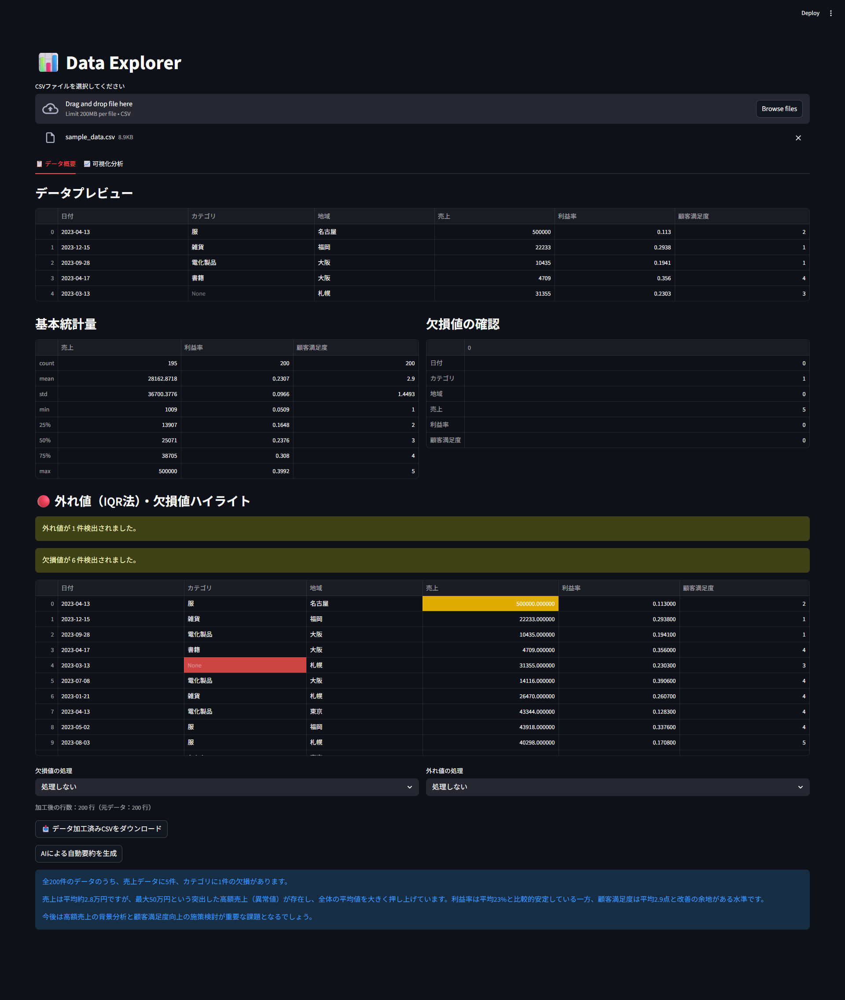
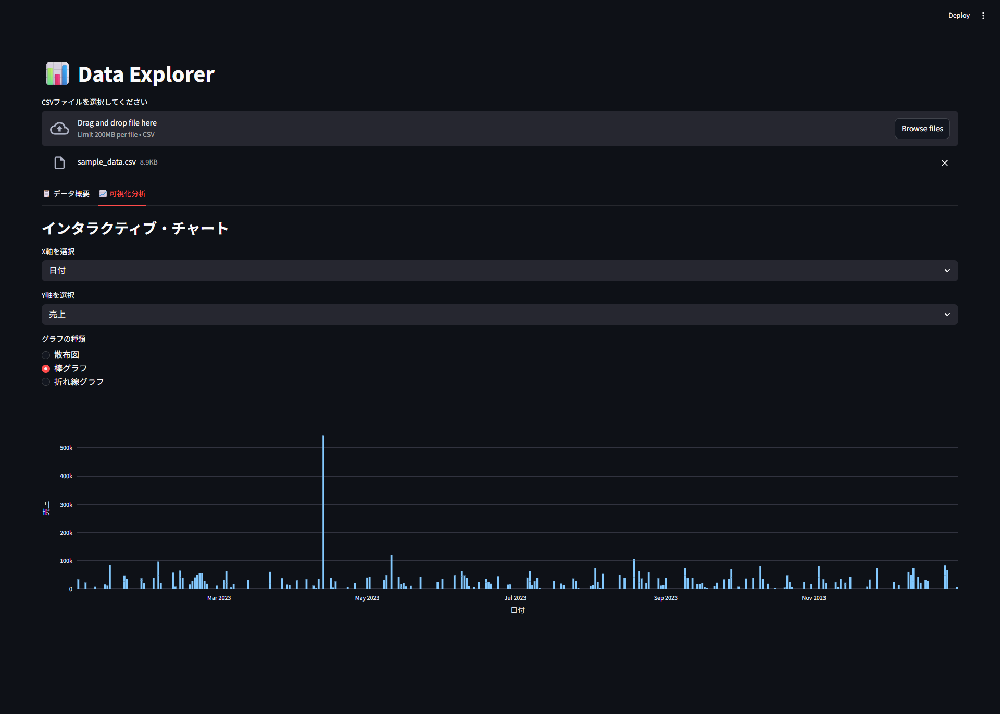

## 概要:  
アップロードしたCSVデータを即座に可視化・分析するためのWebアプリケーションです。  
現在、各種ドキュメントの作成中です。  

サンプルデータは data/ にあります。  
データの再生成は scripts/ 下のスクリプトで可能です。  

## なぜこれを作ったか:  
Pythonおよびバックエンド開発のスキルを実践的に習得するために作成しました。

「動くものを作る」だけでなく、実務を意識した以下の点にこだわっています：
- 例外処理・ログ出力など、チーム開発で求められる品質基準の実装
- pytest によるテストの自動化
- 定数・ユーティリティの分離による保守しやすい設計

## 機能:  
- CSVファイルのアップロードと即時プレビュー  
- 統計情報の表示（平均・中央値・標準偏差など）  
- グラフ可視化（Plotly）  
- AIによるデータ自動要約（Google Gemini API）  
- 欠損値・外れ値の検出とハイライト表示  
- 欠損値・外れ値を加工したCSVのダウンロード  
- エラー発生時のログ出力  

## スクリーンショット:  

### データ概要タブ  
  

### 可視化分析タブ  
  

## ディレクトリ構成
```
Data-Explorer/
├── app.py          # メインアプリ
├── ai_summary.py   # AI要約機能
├── constants.py    # 定数
├── utils.py        # 汎用関数
├── data/           # サンプルデータ
├── docs/           # ドキュメント・画像
├── scripts/        # データ生成スクリプト
└── tests/          # テストコード
```

## 使用技術:  
| カテゴリ | 技術 |  
|---|---|  
| フロントエンド | Streamlit |  
| データ処理 | Pandas |  
| 可視化 | Plotly |  
| AI要約 | Google Gemini API（gemini-2.5-flash）|  
| 環境変数管理 | python-dotenv |  
| テスト | pytest |  
| 言語 | Python 3.11+ |  

## セットアップ手順:  
### 1. リポジトリのクローン  
git clone https://github.com/hrdhrk07-spec/data-explorer.git  
cd data-explorer  

### 2. ライブラリのインストール  
pip install -r requirements.txt  

### 3. APIキーの設定 ← 追加セクション  
AI要約機能にはGoogle Gemini APIキーが必要です。  

1. [Google AI Studio](https://aistudio.google.com) にアクセス  
2. Googleアカウントでログインし、APIキーを発行  
3. プロジェクトルートに`.env`ファイルを作成し、以下を記載：  

GEMINI_API_KEY=your_api_key_here  

> ⚠️ `.env`ファイルは`.gitignore`により管理対象外です。  

### 4. アプリの起動  
streamlit run app.py  

## ⚠️ 注意事項  
- AI要約機能はGoogle Gemini APIの**無料枠**で十分使用可能です  
- APIキーなしでも、AI要約機能以外はすべて動作します  
- `.env`ファイルは`.gitignore`で除外済みのため、クローン後に別途作成が必要です  
