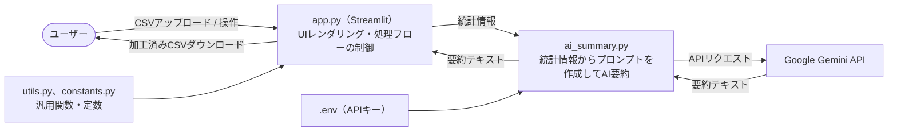

# アーキテクチャ図

```mermaid
graph LR
    User([ユーザー])
    User -->|CSVアップロード / 操作| App
    App -->|加工済みCSVダウンロード| User

    App["app.py（Streamlit）<br/>UIレンダリング・処理フローの制御"]

    Utils["utils.py、constants.py<br/>汎用関数・定数"] --> App
    App -->|統計情報| AI["ai_summary.py<br/>統計情報からプロンプトを作成してAI要約"]
    Env[".env（APIキー）"] --> AI
    AI -->|要約テキスト| App

    AI -->|APIリクエスト| Gemini["Google Gemini API"]
    Gemini -->|要約テキスト| AI

    
```